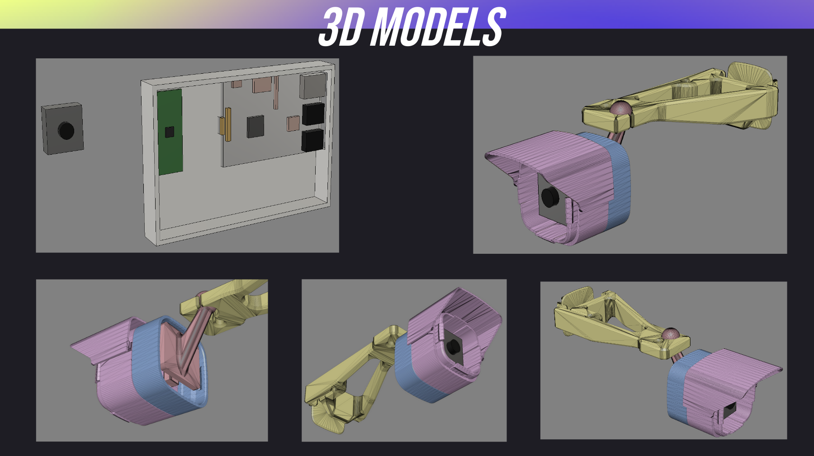

# Vehicle Measurement System
an embedded system that can detect and measure vehicles

---
Author: *Lukas Gunnarsson* 
Project start: *24/1-2023* 

### Dependencies
- freeRTOS
- Micropython
- PiCamera

### System components
 - Raspberry Pi 1 Model B
 - Raspberry Pi Pico W
 - PiCamera v2 module
 - Wiring

---
## VMS
The system is called VMS for short and the abbreviation is used in the code structure to give a clear indicitation to what's what.

### VMSClient
The client side which is located on the **Pico W**.

### VMSCamera
Camera component of the system which resides on the **Raspberry Pi**.

### VMSServer
Server to recieve the transmitted data from **VMSClient**.

<strong>How it works</strong>:

 VMSCamera 🠲  VMSClient ⇆ VMSServer 
 
VMSCamera takes the pictures and sends them via the UART to the Pico W which is the client (VMSClient).  
The Pico W then sends the frames to the server via a p2p connection which in turn takes appropriate action (e.g saving the frames, recognizing errors etc). 
The saved frames/images are then sent to another program which processes the images and determines the length of the vehicles.

---

## Model design

Model design using <strong>Fusion360</strong>

---

## Code

---

## Misc

### Data transfer speeds

UART communication via GP4 and GP5 on the Pico W.
 

| Resolution | FPS | Depth (bits) | Frame size (mb)| Data transfer/s (mb/s) |
|----------  | --- | --- | --- | --- |
| 640x480    | 20  |   24    | 0.920 | 18.4 |
| 640x480    | 20  |   12    | 0.461 | 9.22 |
| 1280x1080 | 20 | 24 | 4.147 | 82.94 |
| 1280x1080 | 20 | 12 | 2.074 | 41.48 |
